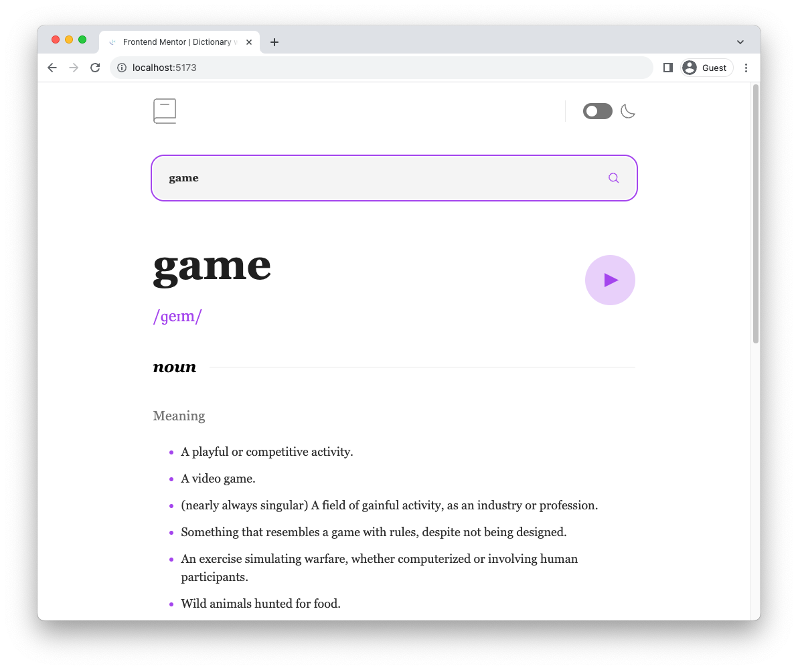
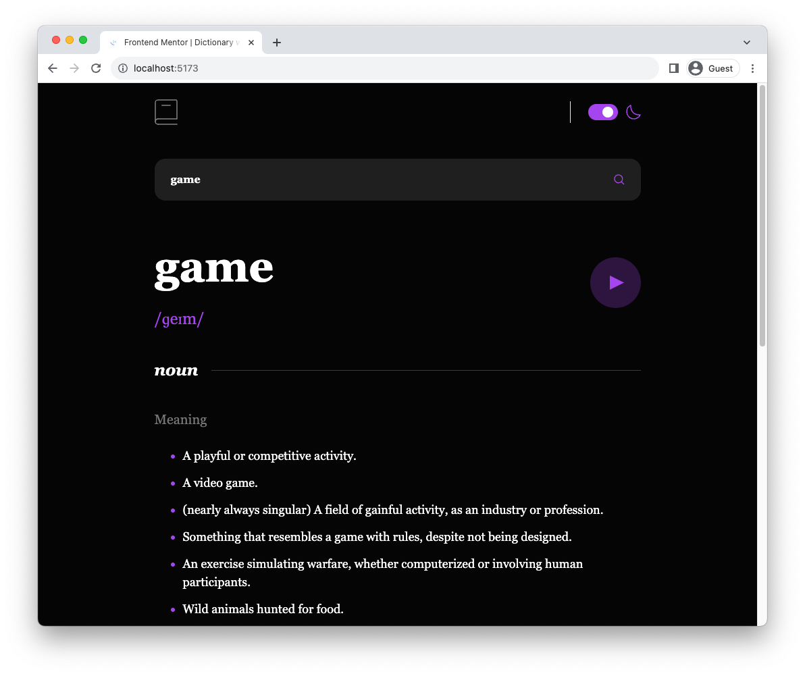

# Dictionary web app

## Table of contents

- [Overview](#overview)
  - [The challenge](#the-challenge)
  - [Screenshot](#screenshot)
  - [Demo](#demo)
- [My process](#my-process)
  - [Built with](#built-with)

## Overview

### The challenge

Users should be able to:

- Search for words using the input field
- See the Free Dictionary API's response for the searched word
- See a form validation message when trying to submit a blank form
- Play the audio file for a word when it's available
- Switch between light and dark themes
- View the optimal layout for the interface depending on their device's screen size

### Screenshot

### Demo

- [Live Site URL](https://your-live-site-url.com)

## My process

### Built with

- Semantic HTML5 markup
- Flexbox
- Mobile-first workflow
- [React](https://reactjs.org/) - JS library
- [SWR](https://swr.vercel.app/) - React Hooks for Data Fetching
- [Tailwind CSS](https://tailwindcss.com/) - For styles
